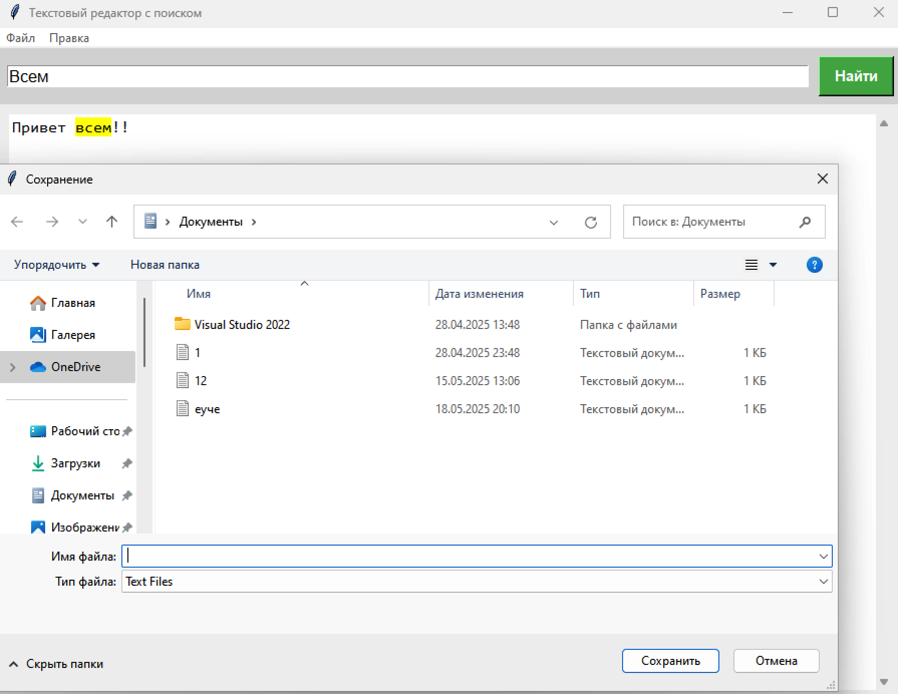
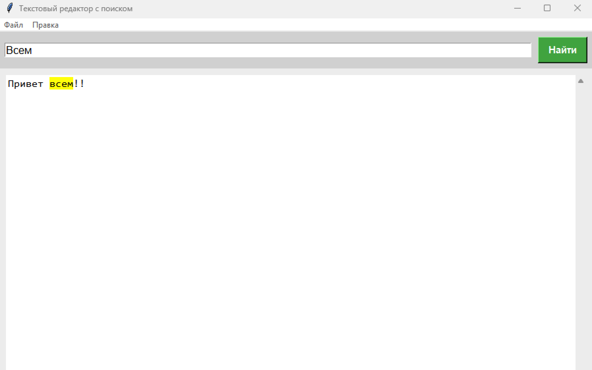

# Python: Создание простого текстового редактора

## Видео-презентация

[Ссылка на видео](https://www.youtube.com/watch?v=xqDonHEYPgA)

---


## Обзор и исследование предметной области

Цель проекта — создать простой и удобный текстовый редактор на языке Python с использованием стандартной библиотеки Tkinter.

Основные задачи:

- Работа с файлами: открытие, сохранение текстовых документов.
- Редактирование: базовые операции (вырезать, копировать, вставить, отмена/повтор).
- Поиск текста с подсветкой совпадений.
- Удобный интерфейс с меню и горячими клавишами.

Исследуемые компоненты:

- Tkinter — для создания графического интерфейса.
- Стандартные диалоги открытия и сохранения файлов.
- Механизмы Undo/Redo и буфер обмена.
- Текстовые виджеты с прокруткой.

---

## Требования

- Python 3.7+
- Библиотека Tkinter (входит в стандартную поставку Python)

---

## Установка и настройка окружения

1. Установить Python (если ещё не установлен).
2. Tkinter обычно включён по умолчанию. Если не установлен, установить через пакетный менеджер (например, в Ubuntu: `sudo apt-get install python3-tk`).
3. Использовать любой удобный редактор кода или IDE (VS Code, PyCharm, Sublime Text и т. д.).

---

## Создание текстового редактора на Python

### 1. Создание главного окна и текстового поля

Используем `Tk` из библиотеки Tkinter для создания главного окна, добавляем `Text` — многострочное текстовое поле, и `Scrollbar` — полосу прокрутки.

```python
import tkinter as tk

root = tk.Tk()
root.title("Мой текстовый редактор")

text_area = tk.Text(root, undo=True)
scrollbar = tk.Scrollbar(root, command=text_area.yview)
text_area.configure(yscrollcommand=scrollbar.set)

scrollbar.pack(side=tk.RIGHT, fill=tk.Y)
text_area.pack(fill=tk.BOTH, expand=True)

root.mainloop()
```

## 2. Меню «Файл»

Добавляем меню с командами:

- Открыть — открытие файла через диалог выбора.
- Сохранить — сохранение текста в файл.
- Выход — закрытие приложения.

```python
import tkinter as tk
from tkinter import filedialog, messagebox

def open_file():
    file_path = filedialog.askopenfilename(filetypes=[("Текстовые файлы", "*.txt"), ("Все файлы", "*.*")])
    if file_path:
        try:
            with open(file_path, "r", encoding="utf-8") as file:
                text_area.delete(1.0, tk.END)
                text_area.insert(tk.END, file.read())
        except Exception as e:
            messagebox.showerror("Ошибка", f"Не удалось открыть файл: {e}")

def save_file():
    file_path = filedialog.asksaveasfilename(defaultextension=".txt",
                                             filetypes=[("Текстовые файлы", "*.txt"), ("Все файлы", "*.*")])
    if file_path:
        try:
            with open(file_path, "w", encoding="utf-8") as file:
                file.write(text_area.get(1.0, tk.END))
        except Exception as e:
            messagebox.showerror("Ошибка", f"Не удалось сохранить файл: {e}")

def exit_editor():
    if messagebox.askokcancel("Выход", "Вы уверены, что хотите выйти?"):
        root.destroy()

# Добавление меню "Файл"
menubar = tk.Menu(root)
filemenu = tk.Menu(menubar, tearoff=0)
filemenu.add_command(label="Открыть", command=open_file, accelerator="Ctrl+O")
filemenu.add_command(label="Сохранить", command=save_file, accelerator="Ctrl+S")
filemenu.add_separator()
filemenu.add_command(label="Выход", command=exit_editor, accelerator="Ctrl+Q")
menubar.add_cascade(label="Файл", menu=filemenu)
```
## 3. Меню «Правка»

### Добавляем команды:

#### Отмена (Undo)
#### Повтор (Redo)
#### Вырезать
#### Копировать
#### Вставить
#### Выделить всё
 
```python
def undo():
    try:
        text_area.edit_undo()
    except tk.TclError:
        pass

def redo():
    try:
        text_area.edit_redo()
    except tk.TclError:
        pass

def cut():
    text_area.event_generate("<<Cut>>")

def copy():
    text_area.event_generate("<<Copy>>")

def paste():
    text_area.event_generate("<<Paste>>")

def select_all():
    text_area.tag_add(tk.SEL, "1.0", tk.END)
    text_area.mark_set(tk.INSERT, "1.0")
    text_area.see(tk.INSERT)

# Добавление меню "Правка"

editmenu = tk.Menu(menubar, tearoff=0)
editmenu.add_command(label="Отмена", command=undo, accelerator="Ctrl+Z")
editmenu.add_command(label="Повтор", command=redo, accelerator="Ctrl+Y")
editmenu.add_separator()
editmenu.add_command(label="Вырезать", command=cut, accelerator="Ctrl+X")
editmenu.add_command(label="Копировать", command=copy, accelerator="Ctrl+C")
editmenu.add_command(label="Вставить", command=paste, accelerator="Ctrl+V")
editmenu.add_separator()
editmenu.add_command(label="Выделить все", command=select_all, accelerator="Ctrl+A")
menubar.add_cascade(label="Правка", menu=editmenu)
root.config(menu=menubar)
```

## 4. Функция поиска

#### Добавляем поле ввода для поиска и реализуем подсветку всех найденных совпадений.

 ```python
def search_text():
    text_area.tag_remove('highlight', '1.0', tk.END)
    search_word = search_entry.get()
    if search_word:
        start_pos = '1.0'
        while True:
            start_pos = text_area.search(search_word, start_pos, nocase=1, stopindex=tk.END)
            if not start_pos:
                break
            end_pos = f"{start_pos}+{len(search_word)}c"
            text_area.tag_add('highlight', start_pos, end_pos)
            start_pos = end_pos
        text_area.tag_config('highlight', background='yellow')

# Добавление панели поиска
search_frame = tk.Frame(root)
search_frame.pack(side=tk.TOP, fill=tk.X)

search_label = tk.Label(search_frame, text="Поиск:")
search_label.pack(side=tk.LEFT)

search_entry = tk.Entry(search_frame)
search_entry.pack(side=tk.LEFT, fill=tk.X, expand=True)

search_button = tk.Button(search_frame, text="Найти", command=search_text)
search_button.pack(side=tk.RIGHT)
```
## Реализация основных функций

### Открытие файла

```python
from tkinter import filedialog

def open_file():
    file_path = filedialog.askopenfilename(filetypes=[("Текстовые файлы", "*.txt"), ("Все файлы", "*.*")])
    if file_path:
        try:
            with open(file_path, "r", encoding="utf-8") as file:
                text_area.delete(1.0, tk.END)
                text_area.insert(tk.END, file.read())
        except Exception as e:
            messagebox.showerror("Ошибка", f"Не удалось открыть файл: {e}")
```
### Сохранение файла

 ```python
def save_file():
    file_path = filedialog.asksaveasfilename(defaultextension=".txt",
                                             filetypes=[("Текстовые файлы", "*.txt"), ("Все файлы", "*.*")])
    if file_path:
        try:
            with open(file_path, "w", encoding="utf-8") as file:
                file.write(text_area.get(1.0, tk.END))
        except Exception as e:
            messagebox.showerror("Ошибка", f"Не удалось сохранить файл: {e}")
```
### Поиск текста с подсветкой

 ```python
def search_text():
    text_area.tag_remove('highlight', '1.0', tk.END)
    search_word = search_entry.get()
    if search_word:
        start_pos = '1.0'
        while True:
            start_pos = text_area.search(search_word, start_pos, nocase=1, stopindex=tk.END)
            if not start_pos:
                break
            end_pos = f"{start_pos}+{len(search_word)}c"
            text_area.tag_add('highlight', start_pos, end_pos)
            start_pos = end_pos
        text_area.tag_config('highlight', background='yellow')
```

# Горячие клавиши

| Команда    | Горячая клавиша | Описание                    |
|------------|-----------------|-----------------------------|
| Открыть    | Ctrl + O        | Открыть файл                |
| Сохранить  | Ctrl + S        | Сохранить файл              |
| Отмена     | Ctrl + Z        | Отмена последнего действия  |
| Повтор     | Ctrl + Y        | Повтор отменённого действия |
| Найти      | Ctrl + F        | Открыть панель поиска       |
| Вырезать   | Ctrl + X        | Вырезать выделенный текст   |
| Копировать | Ctrl + C        | Копировать выделенный текст |
| Вставить   | Ctrl + V        | Вставить из буфера обмена   |
| Выделить всё | Ctrl + A      | Выделить весь текст         |
| Выход      | Ctrl + Q        | Закрыть приложение          |

---

# Заключение

В ходе проекта был создан простой текстовый редактор на Python с использованием Tkinter, который поддерживает:

- Открытие и сохранение текстовых файлов.
- Базовые операции редактирования.
- Поиск текста с подсветкой совпадений.
- Удобный интерфейс с меню и горячими клавишами.

